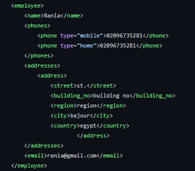
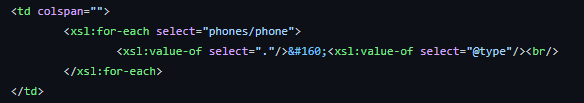
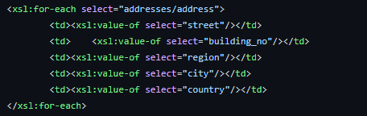
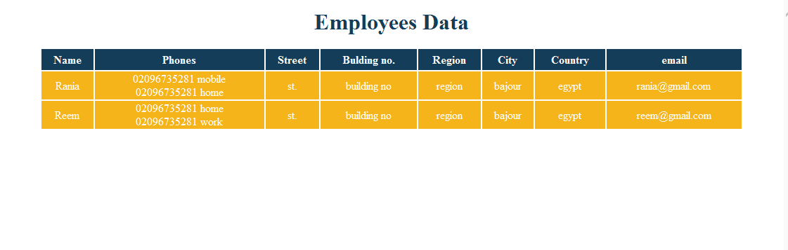

# XML-Styling-With-XSLT Using XMLSpy
## Display XML data in a table with styling.
* Link XML file with XSL file\
\
Our root "emplyees" may have more than one "employee"
* "employee" consists of:\

* display "phones" for employee with its "type"\

* display "address" for the emplyee\

### Output

